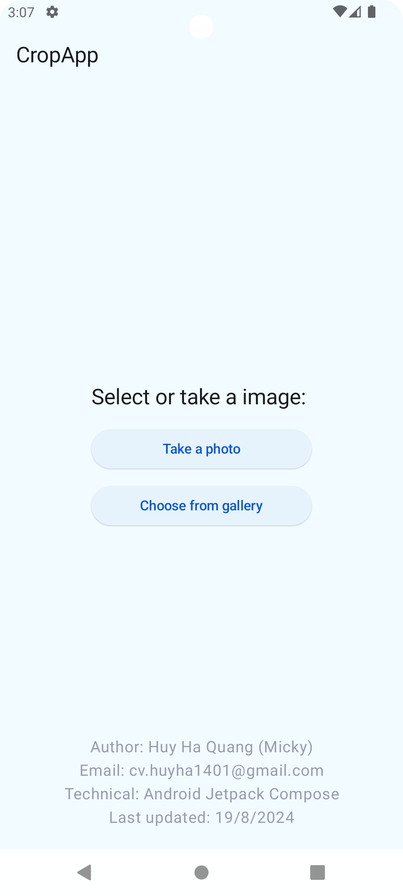
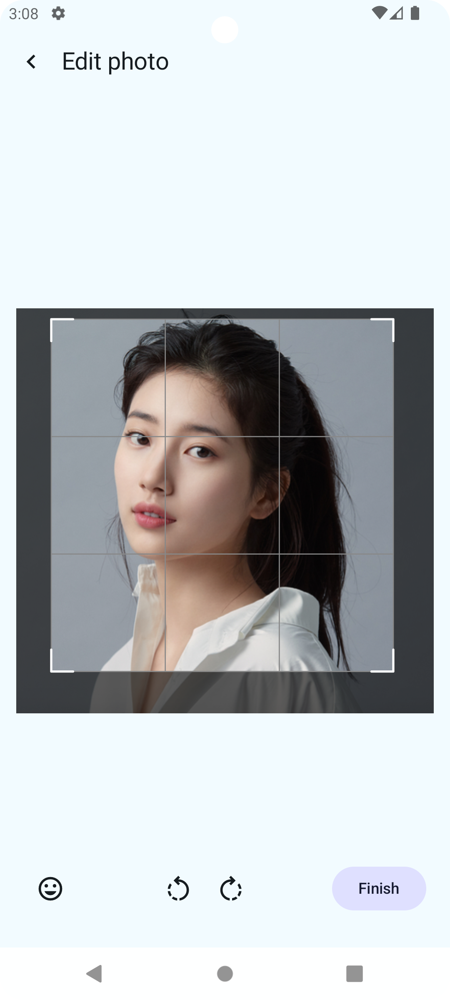

# Crop Image Sample
A sample project to implement take photo/open, crop and save image.

## Technology:
- Language: Kotlin (Jetpack Compose)  
- Skills: Camera hardware, Rotate bitmap image, Write bitmap image

## Implemented features:
- Rotate image, crop image
- Step:
   + Take a photo or select photo from gallery
   + Using rotate or crop function
   + Save image to storage

## Demo

 &emsp;  &emsp;  &emsp; 

<video width="320" controls>
  <source src="asset/crop_module.mov" type="video/mov">
</video>

 
## Ref 
-  Source code: https://github.com/MickyHQH/crop_image_module
- Core in: https://github.com/SmartToolFactory/Compose-Cropper