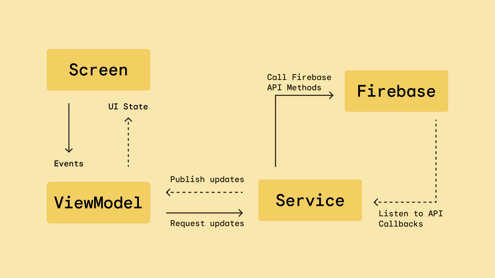
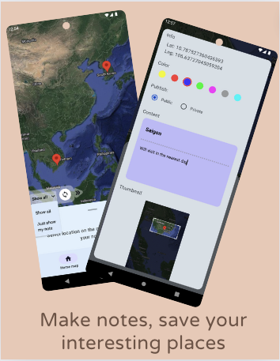

# Landmark Remark
The application allows notes on the map

## Technology:
- Language: Kotlin (Jetpack Compose)  
- Tools: Firebase (Auth, Firestore, Storage), Google map API

# Model:

## Implemented features:
- Make notes, save your interesting places
- View all public notes from community
- Create your notes with private mode

## Todo features:
- Search feature (by location name, by username)

## Demo

 &emsp;  &emsp;  &emsp; 
