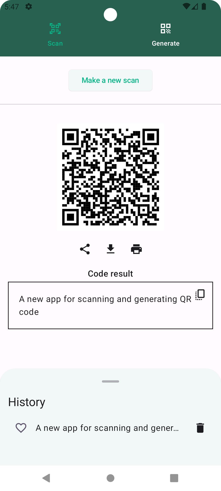
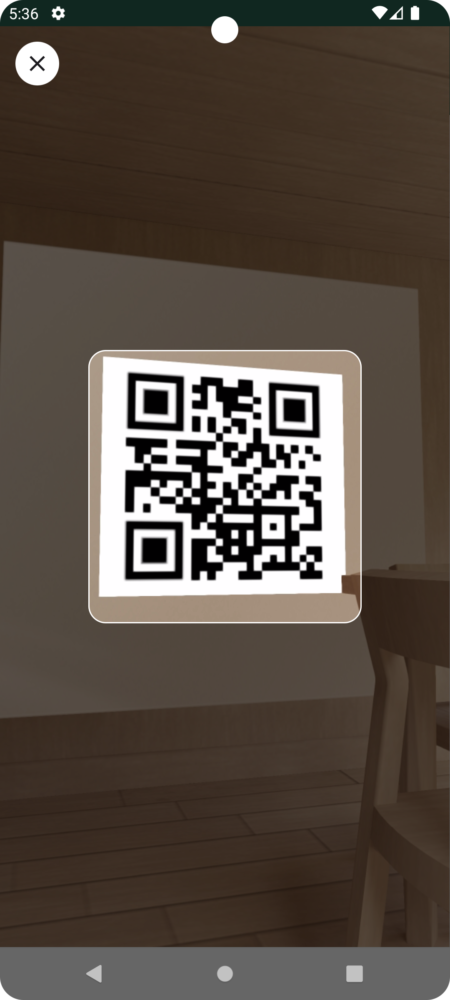
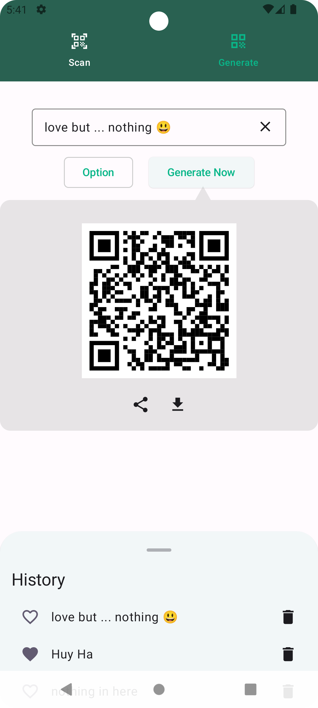
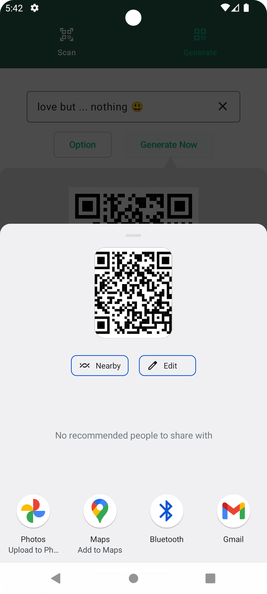

# QR Code Manager
A new app for scanning and generating QR code.

## Technology:
- Language: Kotlin (Jetpack Compose), DI (Hilt)  
- Skills: Camera hardware + Google MLKit

## Implemented features:
- Scan QR Code
- Generate QR Code
- Share QR as image
- Save history, favorites

## Demo

 &emsp;  &emsp;  &emsp;  &emsp; 
 

https://github.com/user-attachments/assets/79528cc2-76a6-4bc3-88f4-548c5f337501

 

## Ref 
- QR Generate core in: https://github.com/lightsparkdev/compose-qr-code
